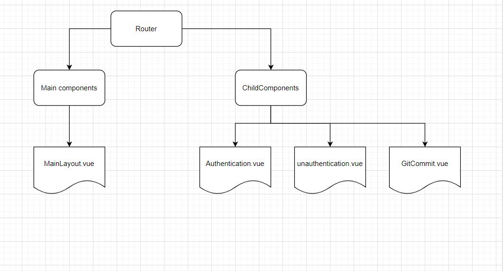

### Final Project architecture diagram  

### Features 

Three simple pages have been created to demonstrate final project features. 

1. Authentication : vue.js will accept the git personal token to list git respositories steps are given below .

2. Unauthentication : vue.js will list git respositories(public) details without accesss token 

3. GitCommit : This page will commit the git respositories .

### What is OAuth?

OAuth is an open-standard authorization protocol or framework that provides applications the ability for “secure designated access.” For example, you can tell Facebook that it’s OK for ESPN.com to access your profile or post updates to your timeline without having to give ESPN your Facebook password. This minimizes risk in a major way: In the event ESPN suffers a breach, your Facebook password remains safe

### Creating an access token

1. In the upper-right corner of any page, click your profile photo, then click Settings.

2. In the left sidebar, click Developer settings.

3. In the left sidebar, click Personal access tokens.

4. Click Generate new token.

5 .Give your token a descriptive name.

### How to authenticate using auth token ? 

The process works like this:

Request: The person asks for access to a server or protected resource. That could involve a login with a password, or it could involve some other process you specify.

Verification: The server determines that the person should have access. That could involve checking the password against the username, or it could involve another process you specify.

Tokens: The server communicates with the authentication device, like a ring, key, phone, or similar device. After verification, the server issues a token and passes it to the user.

Storage: The token sits within the user's browser while work continues.

If the user attempts to visit a different part of the server, the token communicates with the server again. Access is granted or denied based on the token.

Administrators set limits on tokens. You could allow a one-use token that is immediately destroyed when the person logs out. Or you could set the token to self-destruct at the end of a specified time period

### AXIOS code example to authenticate  ? 

const api = 'https://api.github.com/users/motilalgit/repos';
const token = 'XXXXXXXXXXXX';

onMounted(async () => {
  const res = await axios.get(api, {
    headers: { Authorization: `Bearer ${token}` },
  });
  rows.value = [];
  const rList = res.data as rowType[];
  const resList = rList.map((row) => {
    const mappedRow: rowType = {
      id: row.id,
      name: row.name,
      url: row.url,
      language: row.language,
      updated_at: row.updated_at,
    };
    return mappedRow;
  });
  console.log('DEBUG', resList);
  rows.value = resList;
});
